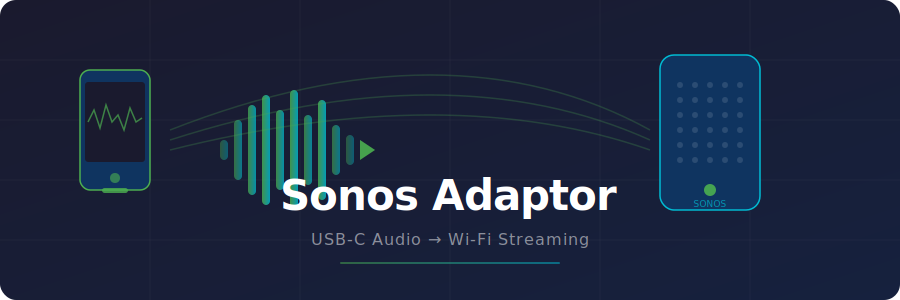

# Sonos Adaptor



An Android app that captures audio from a USB-C input (turntable, mixer, instrument, etc.) and streams it in real time to Sonos speakers or any UPnP/DLNA receiver on your local network.

## What it does

- Reads audio from a USB-C audio interface connected to your Android phone
- Streams the audio over Wi-Fi to Sonos speakers or UPnP receivers (tested with Sonos SYMFONISK and Denon AVR)
- Discovers devices automatically on your network via SSDP
- Lets you switch output between phone speaker and any discovered device on the fly
- Shows connection status (Inactive / Connecting / Connected) for the selected output

## How it works

The app runs a foreground service that:
1. Opens an `AudioRecord` on the USB-C input
2. Starts a local HTTP WAV streaming server on port 8888
3. Sends UPnP SOAP commands (`SetAVTransportURI` + `Play`) to tell the target device to pull audio from `http://<phone-ip>:8888/stream.wav`
4. The device connects and pulls a continuous PCM WAV stream

## Requirements

- Android 7.0 (API 24) or higher
- A USB-C audio interface or adapter connected to your phone
- The phone and target speakers/receivers must be on the same Wi-Fi network
- `RECORD_AUDIO` permission (prompted on first launch)

## Setup

1. Clone the repo:
   ```bash
   git clone git@github.com:kamyaar/Sonos-Adaptor.git
   ```
2. Open in Android Studio
3. Connect your Android phone via USB with developer mode enabled
4. Press **Run** or use:
   ```bash
   ./gradlew installDebug
   ```

## Usage

1. Plug your USB-C audio source into your phone
2. Open the app and tap **Start** — grant microphone permission if prompted
3. Tap the speaker button to open the device picker
4. Select a Sonos room or UPnP receiver — the app connects immediately
5. Use **Test Output** to play a short tone and verify the connection
6. To switch back to the phone speaker, open the picker and select **Phone Speaker**

## Tested devices

| Device | Status |
|--------|--------|
| Sonos SYMFONISK (firmware 95.0) | Working |
| Sonos SYMFONISK (firmware 86.7) | Working |
| Denon AVR-X1200W | Working |

## Project structure

```
app/src/main/java/com/example/sonosadaptor/
├── MainActivity.kt           — UI (Jetpack Compose)
├── AudioPassthroughService.kt — Foreground service, audio capture loop
├── AudioStreamServer.kt      — HTTP WAV streaming server
├── SonosController.kt        — UPnP SOAP commands
├── SsdpDiscovery.kt          — Network device discovery
└── AudioOutput.kt            — Data model (PhoneSpeaker / SonosSpeaker)
```

## Notes

- The app captures USB-C input only — it does not capture phone audio (YouTube, Spotify, etc.)
- If no USB-C device is connected, `AudioRecord` falls back to the built-in microphone
- Port 8888 must be reachable from the target device (no firewall blocking local traffic)
